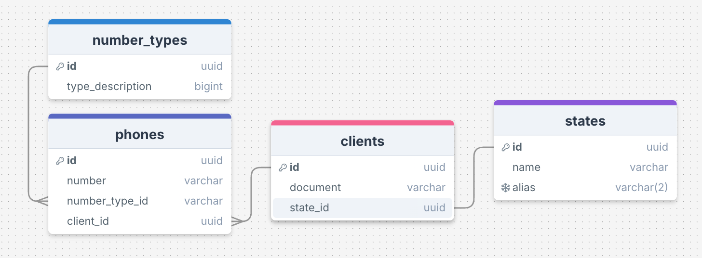

# Desafio Target

## 1. Observe o trecho de código:

```java
int INDICE = 12, SOMA = 0, K = 1;

enquanto K < INDICE faça

{ K = K + 1; SOMA = SOMA + K;}

imprimir(SOMA);
```

Ao final do processamento, qual será o valor da variável SOMA?

**R: 66 (index.ts)**

## 2. Descubra a lógica e complete o próximo elemento:

a) 1, 3, 5, 7, R: 9 - **Progresão aritmética de razão 2.**

b) 2, 4, 8, 16, 32, 64, R: 128 - **Progresão geométrica de razão 2.**

c) 0, 1, 4, 9, 16, 25, 36, R: 49 - **Quadrados perfeitos.**

d) 4, 16, 36, 64, R: 100 - **Quadrados perfeitos e com raízes pares**.

e) 1, 1, 2, 3, 5, 8, R: 13 - **Sequência de Fibonacci**.

f) 2,10, 12, 16, 17, 18, 19, R: 200 - **Números que começam com a letra 'D'**.

## 3. Dado um vetor que guarda o valor de faturamento diário de uma distribuidora de todos os dias de um ano, faça um programa, na linguagem que desejar, que calcule e retorne:

- O menor valor de faturamento ocorrido em um dia do ano;
- O maior valor de faturamento ocorrido em um dia do ano;
- Número de dias no ano em que o valor de faturamento diário foi superior à média anual.

a) Considerar o vetor já carregado com as informações de valor de faturamento.

b) Podem existir dias sem faturamento, como nos finais de semana e feriados. Estes dias devem ser ignorados no cálculo da média.

c) Utilize o algoritmo mais veloz que puder definir.

**R: main.go**

## 4. Banco de dados

Uma empresa solicitou a você um aplicativo para manutenção de um cadastro de clientes. Após a reunião de definição dos requisitos, as conclusões foram as seguintes:

- Um cliente pode ter um número ilimitado de telefones;
- Cada telefone de cliente tem um tipo, por exemplo: comercial, residencial, celular, etc. O sistema deve permitir cadastrar novos tipos de telefone;
- A princípio, é necessário saber apenas em qual estado brasileiro cada cliente se encontra. O sistema deve permitir cadastrar novos estados;

Você ficou responsável pela parte da estrutura de banco de dados que será usada pelo aplicativo. Assim sendo:

- Proponha um modelo lógico para o banco de dados que vai atender a aplicação. Desenhe as tabelas necessárias, os campos de cada uma e marque com setas os relacionamentos existentes entre as tabelas;
- Aponte os campos que são chave primária (PK) e chave estrangeira (FK);
- Faça uma busca utilizando comando SQL que traga o código, a razão social e o(s) telefone(s) de todos os clientes do estado de São Paulo (código “SP”);

**R: Esquema de banco de dados**


```SQL
-- Criando as tabelas de acordo com o esquema acima.

CREATE TABLE IF NOT EXISTS states (
  id uuid PRIMARY KEY NOT NULL DEFAULT gen_random_uuid(),
  nome varchar(50) NOT NULL,
  state_code varchar(2) UNIQUE NOT NULL
);

CREATE TABLE IF NOT EXISTS phone_types (
  id uuid PRIMARY KEY NOT NULL DEFAULT gen_random_uuid(),
  type_description varchar(50) NOT NULL
);

CREATE TABLE IF NOT EXISTS clients (
  id uuid PRIMARY KEY NOT NULL DEFAULT gen_random_uuid(),
  name varchar(255) NOT NULL,
  document varchar(100) NOT NULL,
  state_id uuid NOT NULL,
  FOREIGN KEY (state_id) REFERENCES states(id)
);

CREATE TABLE IF NOT EXISTS phones (
  id uuid PRIMARY KEY NOT NULL DEFAULT gen_random_uuid(),
  phone_number varchar(50) NOT NULL,
  client_id uuid NOT NULL,
  phone_type_id uuid NOT NULL,
  FOREIGN KEY (client_id) REFERENCES clients(id),
  FOREIGN KEY (phone_type_id) REFERENCES phone_types(id)
);
-- Query SQL para buscar os clientes do estado de São Paulo com união.
SELECT
  c.id,
  c.document,
  p.phone_number

FROM
  clients c

JOIN
  phones p ON c.id = p.client_id

JOIN
  states s ON c.state_id = s.id

WHERE s.state_code = 'SP';
```

## 5. Dois veículos, um carro e um caminhão, saem respectivamente de cidades opostas pela mesma rodovia. O carro, de Ribeirão Preto em direção a Barretos, a uma velocidade constante de 90 km/h, e o caminhão, de Barretos em direção a Ribeirão Preto, a uma velocidade constante de 80 km/h. Quando eles se cruzarem no percurso, qual estará mais próximo da cidade de Ribeirão Preto?

a) Considerar a distância de 125km entre a cidade de Ribeirão Preto <-> Barretos.

b) Considerar 3 pedágios como obstáculo e que o carro leva 5 minutos a mais para passar em cada um deles, pois ele não possui dispositivo de cobrança de pedágio.

c)Explique como chegou no resultado.

**Resposta:**

- Considerando que os veículos estão se aproximanto, suas as velocidades são relativas
  e,logo, somadas.
- Considerando que o carro, demorará 15 minutos (1/4 de hora) a mais, devido à
  espera de 5min em cada pedágio.
- Considerando a distância de entre as cidades como D e o tempo como t.

Podemos identificar o tempo de encontro, pois a velocidade e a distância são conhecidas.
O atraso do carro afetará somente o tempo em que ele concluirá a viagem completa,
mas não impacta na distância necessáriamente percorrida para o encontro.

```math
t = distancia / v1 + v2
t = 125 / 90 + 80
t ~= 0,735
```

Assim, pode-se calcular a distância percorrida pelo carro:

```math
dCarro = 90 * t
dCarro = 66,15km
```

De igual modo, a distância percorrida pelo caminhão:

```math
dCaminhao = 80 * 0,735
dCaminhao = 58,8km
```

Diante disso, conclui-se que o carro está a 66,15km de Ribeirão Preto, enquanto
o caminhão está a 58,8km de Barretos, ou seja, a 56,2km de Ribeirão Preto.

**Portanto, o caminhão estará mais próximo de Ribeirão Preto.**
